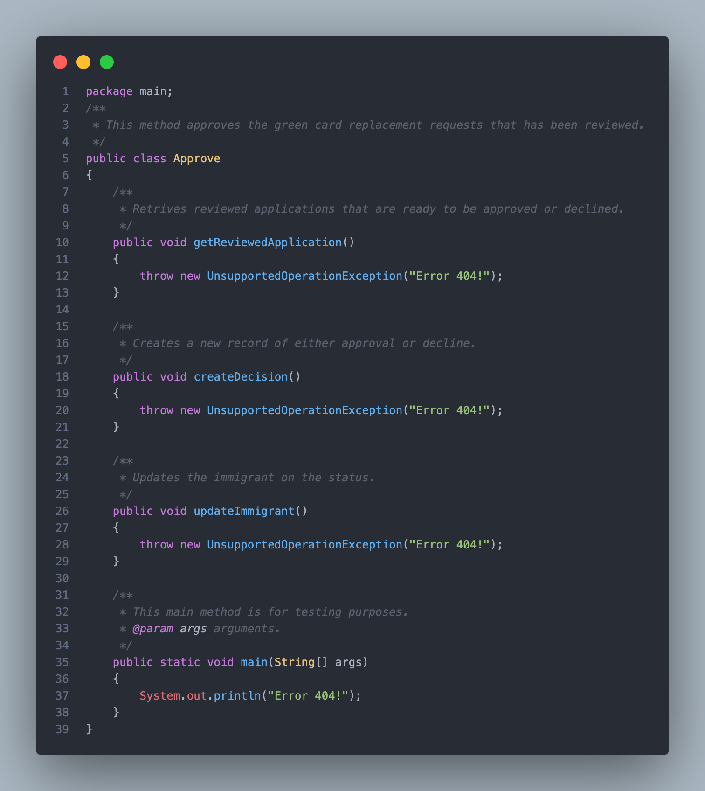
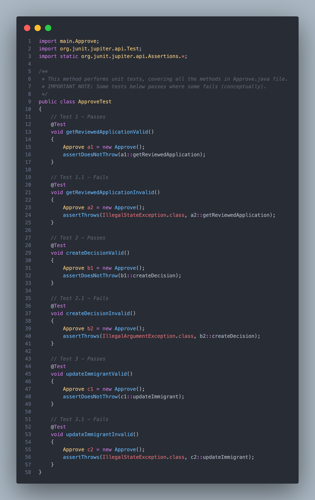

# Project i90 - Approve Portal

## Iteration 3 Required Features

- [x] Comprehensive unit tests covering required methods (30 points)
- [x] 10 points each for create, update and get (5 points for pass and 5 points for fail)
- [x] Clear and meaningful test method names (5 points)
- [x] Clean and well-organized code and test files
- [x] Consistent coding style and formatting
- [x] Adequate comments and documentation within the code for both classes and tests

## Demo

    <a href="https://www.loom.com/share/f38b04eb2e7c4a14b3d9ddf7b346ce42">
      
Tests run: 6, Failures: 6, Errors: 0, Skipped: 0

    </a>
    

## Code Highlights

## License
© 2025 Mohammed Abdur Rahman, Aahil Shaik, Hamza Khan. All Rights Reserved.

This project is provided for educational and portfolio purposes only.

Copying, reusing, or submitting this code for any coursework, academic credit,
or commercial use without explicit permission from the author is strictly prohibited.

Violations may constitute academic integrity violations and/or copyright infringement.
